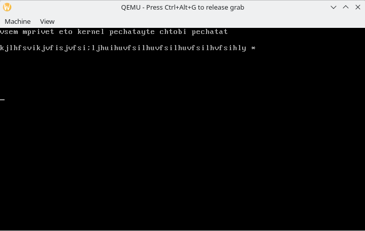

# os-project_Tab

Рекомендованная ОС для запуска: KDE NEON
Чтобы запустить:
1. Загрузить утилиты gcc, nasm, qemu
2. Скачать файлы из репозитория в отдельную папку
3. Открыть папку с файлами в консоли
4. Собрать проект:
   1) Выполнить команду: nasm -f elf32 kernel.asm -o kasm.o
   2) Выполнить команду: gcc -m32 -c kernel.c -o kc.o
   3) Выполнить команду: gcc -fno-stack-protector -m32 -c kernel.c -o kc.o
   4) Выполнить команду: ld -m elf_i386 -T link.ld -o kernel kasm.o kc.o
5. Запустить на эмуляторе: qemu-system-i386 -kernel kernel
